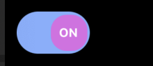
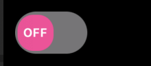

# pcharles-smart-switch

`pcharles-smart-switch` is a customizable React Native smart switch component with optional labels inside the switch for "ON" and "OFF" states.

## Installation

Install the package in your project:

```bash
npm install pcharles-smart-switch
```

## Usage

Below is an example of how to use the `SmartSwitch` component in your React Native application:




```tsx
import React, { useState } from 'react';
import { View } from 'react-native';
import SmartSwitch from 'pcharles-smart-switch';

const App = () => {
  const [isEnabled, setIsEnabled] = useState(false);

  const toggleSwitch = () => {
    setIsEnabled((prevState) => !prevState);
    console.log('Switch state changed:', !isEnabled);
  };

  return (
    <View>
      {/* Switch with labels inside */}
      <SmartSwitch
        showLabels={true}
        isEnabled={isEnabled}
        toggleSwitch={toggleSwitch}
        trackColor={{ false: '#767577', true: '#81b0ff' }}
        thumbColorEnabled="#f5dd4b"
        thumbColorDisabled="#f49"
      />

      {/* Switch without labels */}
      <SmartSwitch
        showLabels={false}
        isEnabled={isEnabled}
        toggleSwitch={toggleSwitch}
        trackColor={{ false: '#767577', true: '#81b0ff' }}
        thumbColorEnabled="#f5dd4b"
        thumbColorDisabled="#f49"
      />
    </View>
  );
};

export default App;
```


### Props

- `isEnabled`: **boolean** (Required) — The state of the switch.
- `toggleSwitch`: **function** (Required) — Function to toggle the switch.
- `showLabels`: **boolean** (Optional) — Whether to display "ON" and "OFF" labels inside the switch. Defaults to `false`.
- `trackColor`: **object** (Optional) — Custom colors for the track in enabled and disabled states.
- `thumbColorEnabled`: **string** (Optional) — Custom color for the thumb when enabled.
- `thumbColorDisabled`: **string** (Optional) — Custom color for the thumb when disabled.
- `iosBackgroundColor`: **string** (Optional) — Custom background color for iOS devices.

## License

This project is licensed under the MIT License.
```
